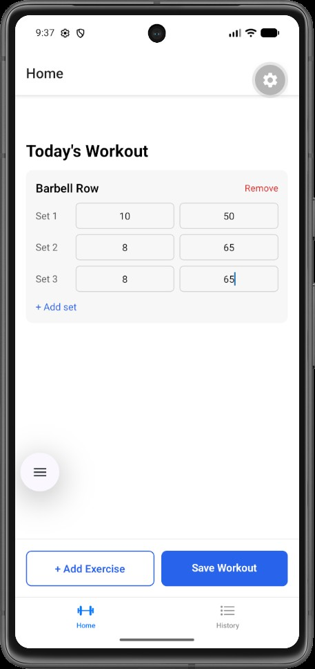
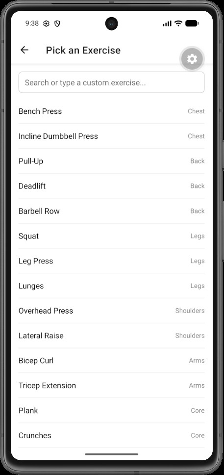
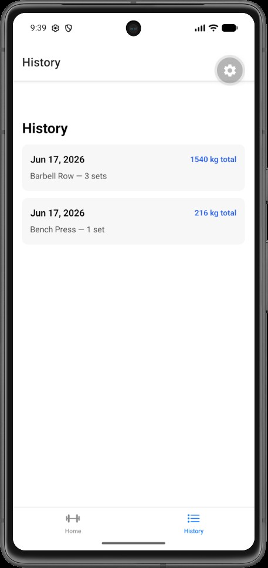

# Gym Workout Log 🏋️

A mobile app for logging gym workouts. Track exercises, sets, reps, and weights, then review your workout history with total volume calculations. Built with React Native and Expo.

## Features

- Log workouts by adding exercises with sets (reps + weight)
- Choose from a built-in exercise library or add custom exercises
- View workout history with date and total volume per session
- Data persists locally on the device (works offline)
- Haptic feedback on saving a workout

## Screenshots

| Home (logging) | Exercise Picker | History |
|---|---|---|
|  |  |  |

## Tech Stack

- **React Native** (0.85) with **Expo** (SDK 56)
- **Expo Router** for file-based navigation (tabs + modal)
- **TypeScript**
- **React Context API** for state management
- **AsyncStorage** for local data persistence
- **expo-haptics** for tactile feedback
- **Jest** for unit testing

## Project Structure

src/

app/ # Screens (Expo Router file-based routing)

(tabs)/ # Tab screens: Home, History

pick-exercise.tsx # Modal exercise picker

components/ # Reusable components (ErrorBoundary)

context/ # WorkoutContext (global state + persistence)

constants/ # Types and default exercise list

utils/ # Pure logic functions (+ tests)

## Setup Instructions

1. Clone the repository:

```bash
   git clone https://github.com/spyde555/gym-workout-log.git
   cd gym-workout-log
```

2. Install dependencies:

```bash
   npm install
```oikp[;']

3. Start the development server:

```bash
   npx expo start
```

4. Press `a` to open on an Android emulator, or scan the QR code with the Expo Go app on your phone.

## Running Tests

```bash
npm test
```

## Building an APK

A preview build can be produced with EAS Build:

```bash
eas build --platform android --profile preview
```
